## <u>Double Pendulum System Dynamics, Simulation and Animation</u> ##

## Background ##

The Python scripts and supporting documents in this repository were developed in 2015 to evaluate the fidelity of Open Dynamics Engine (ODE) modeling of a simple physical system. Since that time there have been countless physics, mechanics and dynamics course lectures, blog articles and YouTube videos presenting computer programs created in almost every programming language (C, C++, C#, Java, Javascript, Julia, MathCad, Mathematica, MATLAB, Python, etc.) to illustrate the simulation and animation of pendulum system dynamics. Therefore, it is not intended that information provided herein will be of any significant value. It is just another double pendulum simulation and animation implementation in Python; which may be of interest, specifically as an implementation utilizing the PyODE, Pygame, NumPy, Matplotlib and SciPy packages.

The inducement to evaluate the fidelity of ODE's modeling of connected rigid body systems stemmed from a desire to utilize the ODE library in modeling bipedal robotic figures (e.g., [viewODE](https://github.com/gedeschaines/viewODE)). One major technical issue with using ODE to implement control of jointed rigid body chains is unavailable joint and body accelerations needed to support forward and inverse dynamics computations. These accelerations must be derived from available joint motion rates, body angular and linear velocities, and joint feadback forces and torques. Development of a method to derive accelerations and its practicality must be evaluated.

To reduce the scope of the evaluation, a planar double pendulum system was chosen as a representative, simple connected rigid body system and the [PyODE Tutorial 2](http://pyode.sourceforge.net/tutorials/tutorial2.html) program was selected as the basis for modifications to perform comparative analysis with derived equations of motion and calculation methods for angular and linear accelerations.

## Content ##

The Python programs contained in this repository are extended versions derived from the original [PyODE Tutorial 2](http://pyode.sourceforge.net/tutorials/tutorial2.html) program. Although core functionality and purpose of the original Python program to demonstrate basic Open Dynamics Engine (ODE) body and joint modeling through simulation and animation of a double pendulum system has been preserved, additional capabilities have been added to elaborate on the equations of motion characterizing pendulum system dynamics. In each program listed below, a system of differential equations of motion are integrated using a Runge-Kutta 4th order method in conjuction with, but independent of the ODE model in order to explore the fidelity of the ODE implemention of a simple physical system.

 1. tutorial2x.py - Uses linearized and non-linearized differential equations of motion for an idealized double pendulum system comprised of point masses connected by massless, infinitely stiff rods using frictionless hinge joints.
 
 2. tutorial2bob.py - Uses non-linearized differential equations of motion for a physical single pendulum system comprised of a solid spherical mass bob suspended from a frictionless hinge joint by a massless, infinitely stiff rod.
 
 3. tutorial2bobs.py - Uses linearized and non-linearized differential equations of motion for an idealized double pendulum system as in tutorial2x.py, and non-linearized differential equations of motion for solid spherical mass bobs connected by massless, infinitely stiff rods using frictionless hinge joints.
 
 4. tutorial2rods.py - Uses non-linearized differential equations of motion for solid, dimensional, infinitely stiff mass rods connected by frictionless hinge joints.

 5. tutorial2arm.py - Two-link Planar 2R robotic arm dynamics, as presented in reference \[8], simulated with ODE and Pygame.

A tutorial2eval.py Python script imported by tutorial2x.py and tutorial2bobs.py programs provides procedures for computing angular and linear accelerations from ODE modeled joints' and bodies' states for the compound double pendulum system.

The following two Python modules provide the Runge-Kutta integration functions and vector/matrix math functions utilized by each of the programs listed above.

  * RK4_Solver.py - Provides a RK4_Solver class from which to instantiate Runge-Kutta 4th order integration method objects.
  * vecMath.py- Provides an assortment of 1x3 vector and 3x3 matrix math functions.

The wxMaxima tutorial2x.wxmx and exported tutorial2x.html files in the [./docs](https://gedeschaines.github.io/tutorial2x) folder present the derivation of non-linearized differential equations of motion utilized in the tutorial2x.py script for the idealized double pendulum system.

## Execution ##

The five tutorial2\[x|bob|bobs|rods|arm].py programs described in the above "Content" section have successfully executed using Python versions 2.7.18 and 3.8.10 provided in an Ubuntu Linux 20.04 LTS release installed in WSL2 for Microsoft Windows 10 Pro version 22H2 OS build 19045.5247 with the requisite Python packages from sources listed in the following table.

 
Requisite packages associated with Ubuntu Linux 20.04 Python version
  <table rows="8" cols="5">
   <tr>
    <th colspan="1"> </th>
    <th colspan="4" align="center">Python Version & Package Source</th>
   </tr>
   <tr>
    <th colspan="1" align="left">Packages</th>
    <th colspan="1" align="center">2.7.18</th>
    <th colspan="1" align="center">Source</th>
    <th colspan="1" align="center">3.8.10</th>
    <th colspan="1" align="center">Source</th>
   </tr>
   <tr>
    <td align="left">PyODE</td>
    <td align="center">0.14</td>
    <td align="center">ODE</td>
    <td align="center">0.14</td>
    <td align="center">ODE</td>
   </tr>
   <tr>
    <td align="left">Pygame</td>
    <td align="center">1.9.6</td>
    <td align="center">apt</td>
    <td align="center">2.1.0</td>
    <td align="center">pip</td>
   </tr>
   <tr>
    <td align="left">NumPy</td>
    <td align="center">1.16.6</td>
    <td align="center">pip</td>
    <td align="center">1.23.0</td>
    <td align="center">pip</td>
   </tr>
   <tr>
    <td align="left">Matplotlib</td>
    <td align="center">2.1.1</td>
    <td align="center">DEB</td>
    <td align="center">3.7.5</td>
    <td align="center">pip</td>
   </tr>
   <tr>
    <td align="left">SciPy</td>
    <td align="center">1.2.3</td>
    <td align="center">pip</td>
    <td align="center">1.3.3</td>
    <td align="center">apt</td>
   </tr>
   <tr>
    <td colspan="5" align="left">Notes: 
       &nbsp;&nbsp;1. ODE - https://github.com/thomasmarsh/ODE 
       &nbsp;&nbsp;2. DEB - https://askubuntu.com/questions/1339872/instaling-matplotlib-for-python-2-7-in-ubuntu-20-04 
    </td>
   </tr>
  </table>
 

 The five programs have also successfully executed using Python versions 2.7.15 and 3.6.12 provided by Anaconda3 2019.10 installed for Microsoft Windows 10 Pro version 22H2 OS build 19045.5247 with the requisite Python packages from sources listed in the following table.

 
Requisite packages associated with Anaconda3 2019.10 Python version
  <table rows="8" cols="5">
   <tr>
    <th colspan="1"> </th>
    <th colspan="4" align="center">Python Version & Package Source</th>
   </tr>
   <tr>
    <th colspan="1" align="left">Packages</th>
    <th colspan="1" align="center">2.7.15</th>
    <th colspan="1" align="center">Source</th>
    <th colspan="1" align="center">3.6.12</th>
    <th colspan="1" align="center">Source</th>
   </tr>
   <tr>
    <td align="left">PyODE</td>
    <td align="center">0.15.2</td>
    <td align="center">pypi</td>
    <td align="center">0.16.2</td>
    <td align="center">ODE</td>
   </tr>
   <tr>
    <td align="left">Pygame</td>
    <td align="center">1.9.2a0</td>
    <td align="center">COG</td>
    <td align="center">2.5.2</td>
    <td align="center">pypi</td>
   </tr>
   <tr>
    <td align="left">NumPy</td>
    <td align="center">1.16.5</td>
    <td align="center">CFG</td>
    <td align="center">1.19.5</td>
    <td align="center">CFG</td>
   </tr>
   <tr>
    <td align="left">Matplotlib</td>
    <td align="center">2.2.5</td>
    <td align="center">CFG</td>
    <td align="center">3.3.4</td>
    <td align="center">CFG</td>
   </tr>
   <tr>
    <td align="left">SciPy</td>
    <td align="center">1.2.1</td>
    <td align="center">DEF</td>
    <td align="center">1.5.3</td>
    <td align="center">CFG</td>
   </tr>
   <tr>
    <td colspan="5" align="left">Notes: 
       &nbsp;&nbsp;1. ODE - https://github.com/thomasmarsh/ODE 
       &nbsp;&nbsp;2. COG - https://stackoverflow.com/questions/19636480/installation-of-pygame-with-anaconda 
       &nbsp;&nbsp;3. CFG - conda -c conda-forge 
       &nbsp;&nbsp;4. DEF - conda -c defaults 
    </td>
   </tr>
  </table>
 

## References ##

The references listed were used to develop the equations of motion for the various pendulum and robotic arm models evaluated herein.

\[1] Greenwood, Donald T., "Principles of Dynamics." Prentice-Hall,
     Inc.: Englewood Cliffs, N.J., 1965.

\[2] Weisstein, Eric W., "Double Pendulum," Eric Weisstein's World
     of Physics. Wolfram Research Inc., 2007. Web available at
     http://scienceworld.wolfram.com/physics/DoublePendulum.html

\[3] Neumann, Erik, "Double Pendulum," Eric Neumann's myPhysicsLab.com,
     web site, Dec. 18, 2010. Web available at
     https://www.myphysicslab.com/pendulum/double-pendulum-en.html

\[4] Nielsen, R.O., Have E., Nielsen, B.T. "The Double Pendulum: First Year
     Project." The Niels Bohr Institute, Mar. 21, 2013. Web available at
     https://paperzz.com/doc/8137378/the-double-pendulum

\[5] Lynch, Kevin M. and Park, Frank C., "Modern Robotics:  Mechanics, 
     Planning, and Control," 3rd printing 2019, Cambridge University
     Press, 2017. Web available at
     http://hades.mech.northwestern.edu/images/2/25/MR-v2.pdf

\[6] Craig, John J., "Introduction to Robotics: Mechanics and Control," 3rd
     ed., Pearson/Prentice-Hall, Upper Saddle River, N.J., 2005.

\[7] Liu, Karen and Jain, Sumit, "A Quick Tutorial on Multibody Dynamics,"
     Tech Report GIT-GVU-15-01-1, School of Interactive Computing, Georgia
     Institute of Technology, 2012. Web available at
     https://studylib.net/doc/14301909/a-quick-tutorial-on-multibody-dynamics

\[8] Dr. Robert L. William II, "Robot Mechanics: Notesbook Supplement for ME
     4290/5290 Mechanics and Control of Robotic Manipulators", Ohio University,
     Mech. Engineering, Spring 2015; web available at
     https://people.ohio.edu/williams/html/PDF/Supplement4290.pdf

## Evaluation Summaries ##

The following subsections present comparative analysis results illustrating an incrementatal approach to evaluating ODE's fidelity. First, the ODE physical system is compared to a linearized ideal system, then a non-linearized ideal system, and finally to a non-linearized, non-idealized (i.e., a physical) system. In all cases, a very small ODE simulation and RK4 integration step size of 0.001 seconds was used to reduce ODE modeling error due to its use of a less than 4th order accurate implicit integration method. Also, the initial pendulum rod angles are set at 25 degrees with respect to vertical so as not to invalidate the use of small angle approximation to linearize the idealized equations of motion in subsections 1.a and 2.a below.  

### 1. Summary of tutorial2x.py Results ###

Since the derived equations of motion (eqom) for an idealized pendulum system neglects the contribution of mass moments of inertia, unlike the physical system modeled with ODE, the integrated solution of the differential eqom are unlikely to match that from ODE. This can obviously be visualized during the pendulum motion animation, but can also be seen in static plots of ODE body and RK4 mass linear and angular velocities vs time.  

#### <u>1.a Linearized Differential Equations of Motion</u> ####

The following animated GIF depicts double pendulum system motion of the ODE physical model as solid blue spheres connected by black rods overlayed with the RK4 integrated linearized eqom as red circles connected by magenta rods.  

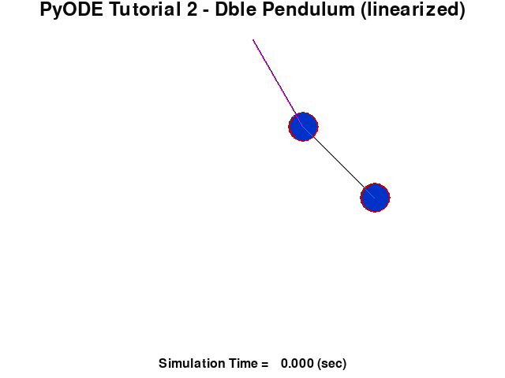  

The following four figures show linear and angular velocities of the RK4 integrated masses begin to diverge from the corresponding ODE bodies before one second of simulation time has elapsed.  

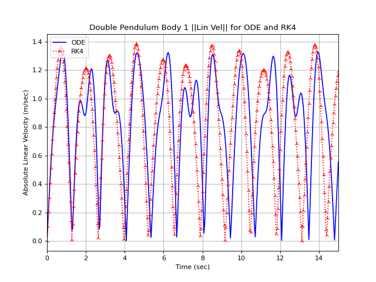
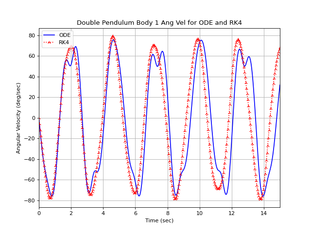
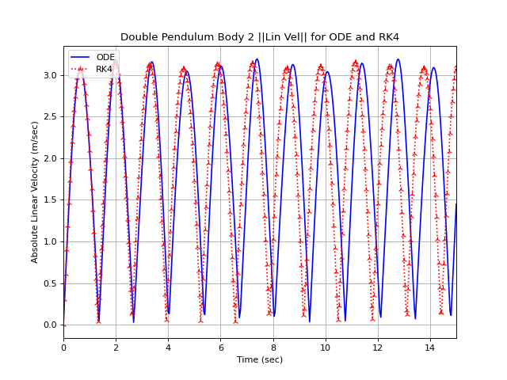
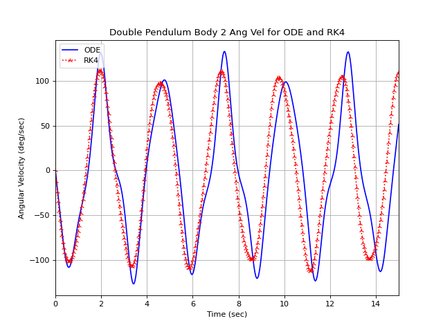 

Note in the following plot of total energy relative to system's minimum potential energy, the accumulated divergence in linear and angular velocities of the RK4 pendulum masses result in a significant variation in total energy as compared to ODE system's total energy.  

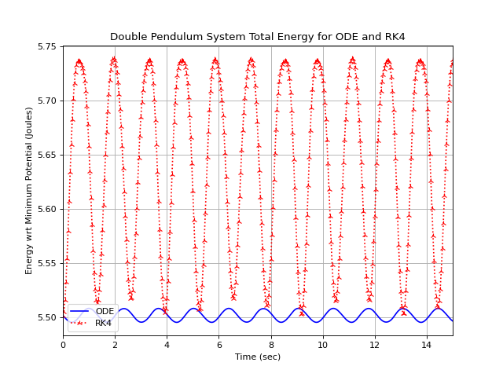  

#### <u>1.b Non-linearized Differential Equations of Motion</u> ####

The following animated GIF depicts double pendulum system motion of the ODE physical model as solid blue spheres connected by black rods overlayed with the RK4 integrated non-linearized eqom as red circles connected by magenta rods.  

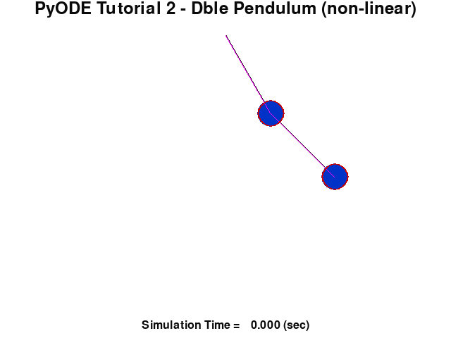  

The following four figures show the linear and angular velocities of the RK4 integrated masses begin to diverge from the corresponding ODE bodies after about two seconds of simulation time has elapsed.  

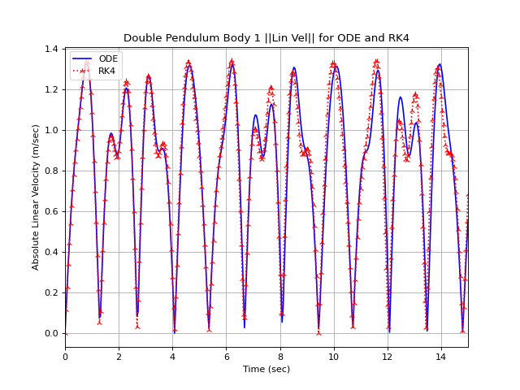
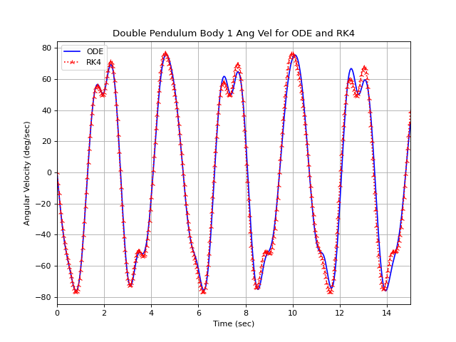
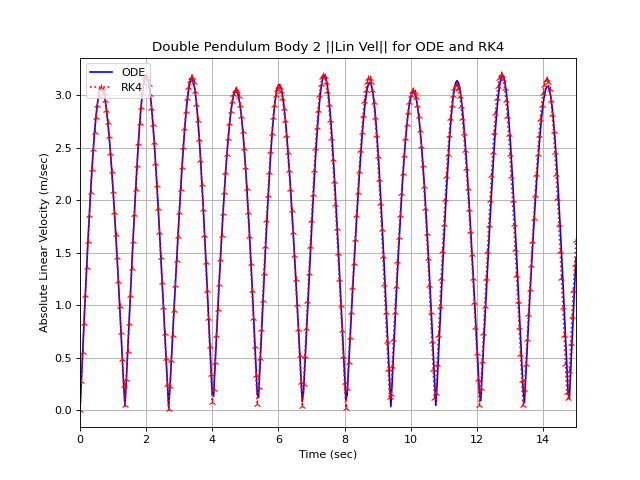
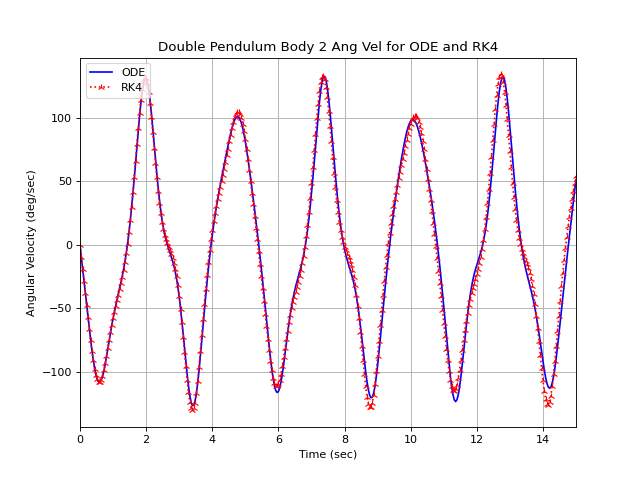  

Note in the following plot of total energy relative to system's minimum potential energy, the accumulated divergence in linear and angular velocities of the RK4 pendulum masses result in a minor variation in total energy when compared to the linearized case above.  

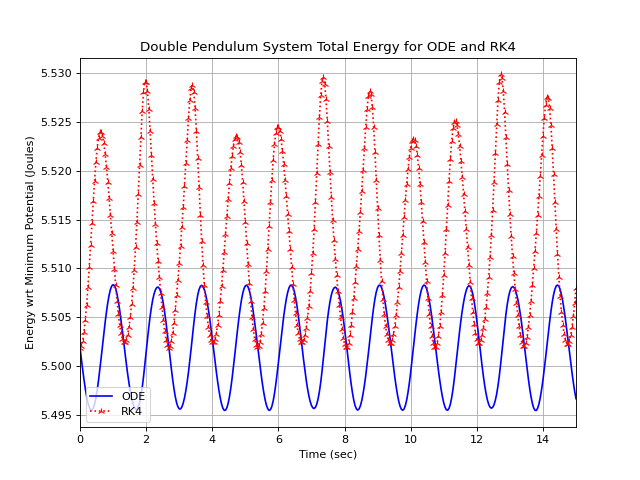  

### 2. Summary of tutorial2bobs.py Results ###

Since the derived equations of motion (eqom) for an idealized pendulum system neglects the contribution of mass moments of inertia, unlike the physical system modeled with ODE, the integrated solution of the differential eqom are unlikely to match that from ODE. This can be obviously seen in plots of body/mass linear and angular velocities vs time as presented in subsection 1.b above and 2.b below. However, the derived equations of motion for a non-idealized pendulum system which accounts for mass moments of inertia should closely match that from ODE as shown in the figures presented in subsection 2.c below.  

#### <u>2.a Linearized, idealized Differential Equations of Motion</u> ####

The following animated GIF depicts double pendulum system motion of the ODE physical model as solid blue spheres connected by black rods overlayed with the RK4 integrated linearized, idealized eqom as red circles connected by magenta rods.  

  

The following four figures show linear and angular velocities of the RK4 integrated masses begin to diverge from the corresponding ODE bodies before one second of simulation time has elapsed. These results should be identical to case 1.a above.  

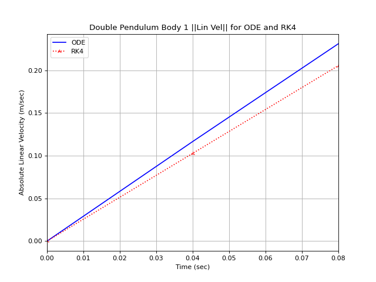
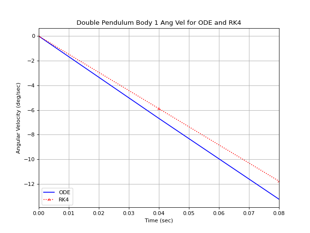
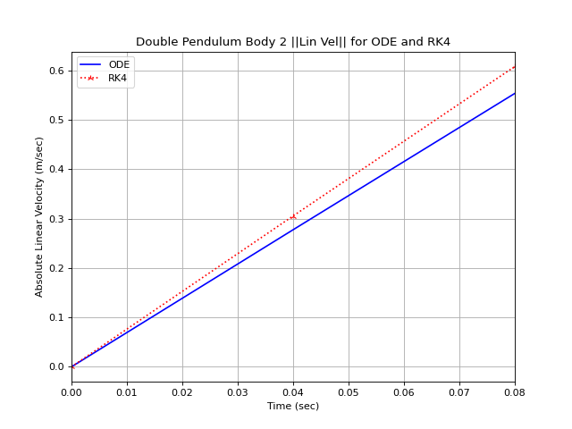
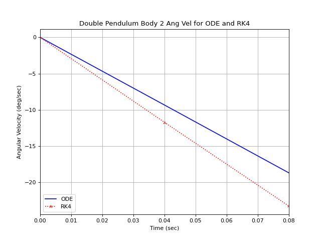  

Note in the following plot of total energy relative to system's minimum potential energy, the accumulated divergence in linear and angular velocities of the RK4 pendulum masses result in a significant variation in total energy as compared to the ODE system's total energy. This plot should be identical to that presented for total energy in case 1.a above.  

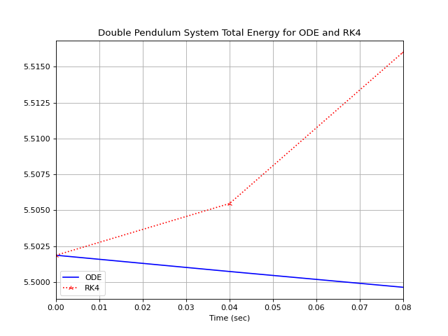  

#### <u>2.b Non-linearized, idealized Differential Equations of Motion</u> ####

The following animated GIF depicts double pendulum system motion of the ODE physical model as solid blue spheres connected by black rods overlayed with the RK4 integrated non-linearized, idealized eqom as red circles connected by magenta rods.  

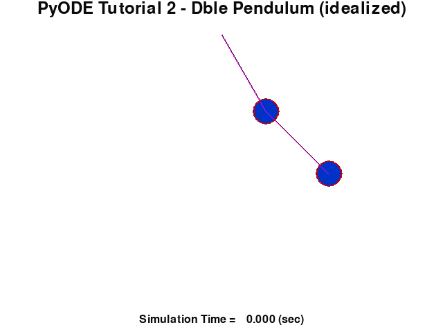  

The following four figures show the linear and angular velocities of the RK4 integrated masses begin to diverge from the corresponding ODE bodies after about two seconds of simulation time has elapsed. Although the differential eqom are derived using different parameterization of motion compared to case 1.b, the results should be identical.  

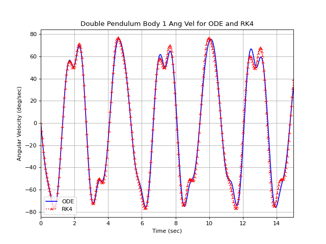

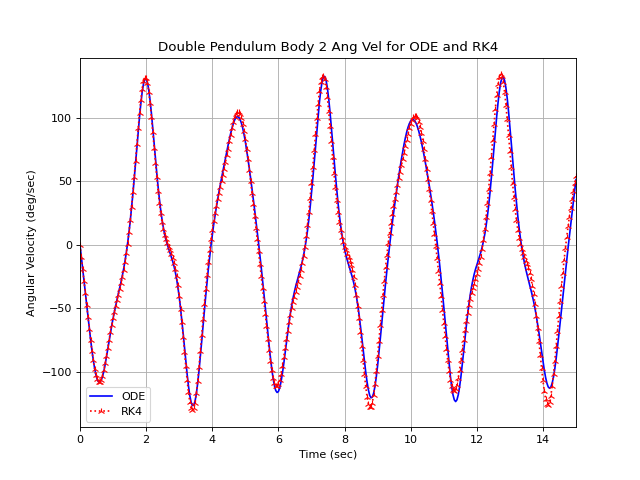  

Note in the following plot of total energy relative to system's minimum potential energy, the accumulated divergence in linear and angular velocities of the RK4 pendulum masses result in a minor variation in total energy when compared to the linearized case above. This plot should be identical to that presented for total energy in case 1.b above.  

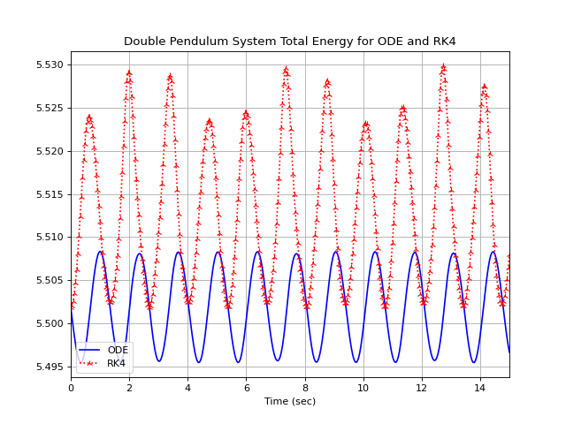  

#### <u>2.c Non-linearized, non-idealized Differential Equations of Motion</u> ####

The following animated GIF depicts double pendulum system motion of the ODE physical model as solid blue spheres connected by black rods overlayed with the RK4 integrated non-idealized (i.e., physical) eqom as red circles connected by magenta rods.  

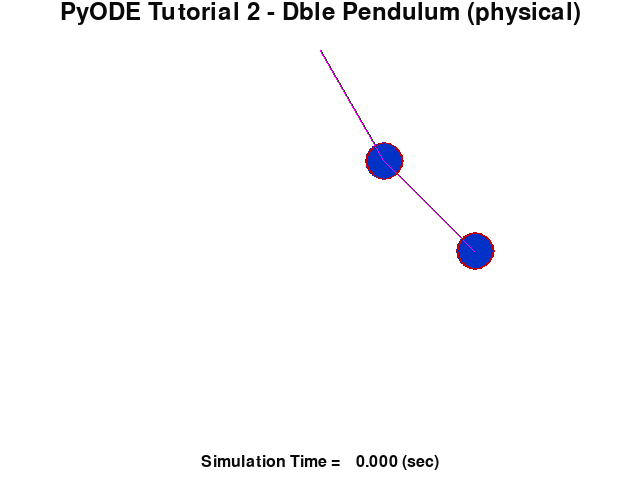  

The following four figures show the linear and angular velocities of the RK4 integrated masses do not noticeably diverge from the corresponding ODE bodies after 15 seconds of simulation time has elapsed.  

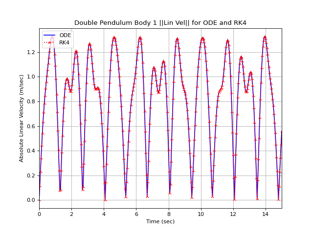
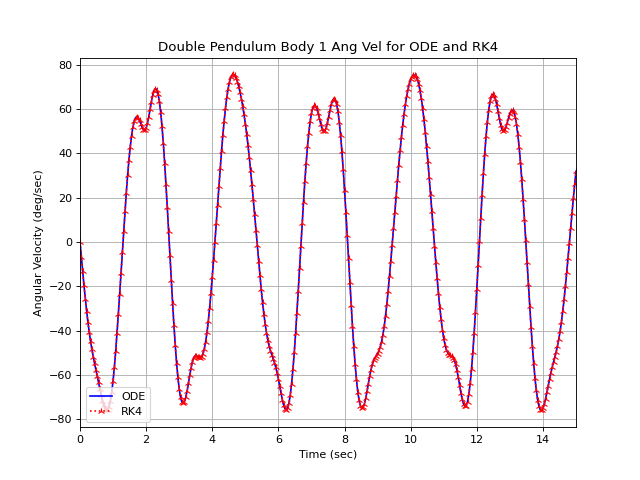
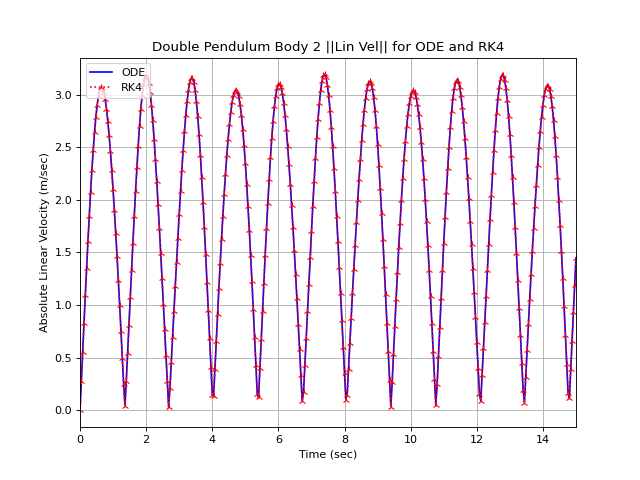
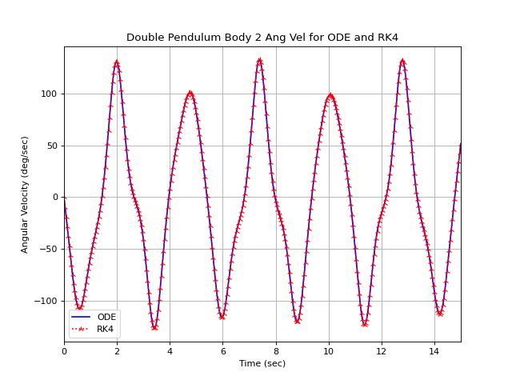  

Note in the following plot of total energy relative to system's minimum potential energy, as expected there is zero variation in total energy of the RK4 integrated system compared to the ODE modeled system.  

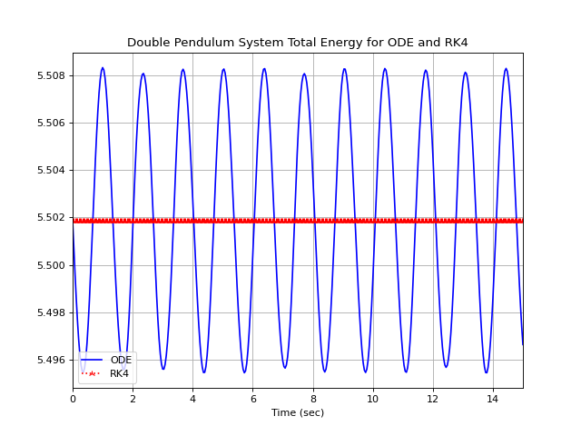  

### 3. Summary of tutorial2rods.py Results ###

TBD

### 4. Summary of tutorial2arm.py Results ###

The inverse dynamics problem presented in the "Numerical Dynamics Section" on page 94 of reference \[8] modeled using the tutorial2arm.py program is presented herein.

The following animated GIF depicts the two-link planar 2R robotic arm motion of the ODE physical model with arms represented by solid blue rectangular boxes and their centers of mass (com) as blue filled circles, interconnected with revolute joints represented with solid black circles, and terminated with an end effector also represented with a solid black circle. The robotic arm motion determined by RK4 integrated eqom is depicted as magenta line segments representing the two links (rods), overlayed on top of the blue rectangular boxes with magenta circles about each rod com, connecting revolute joints and end effector represented as red circles.

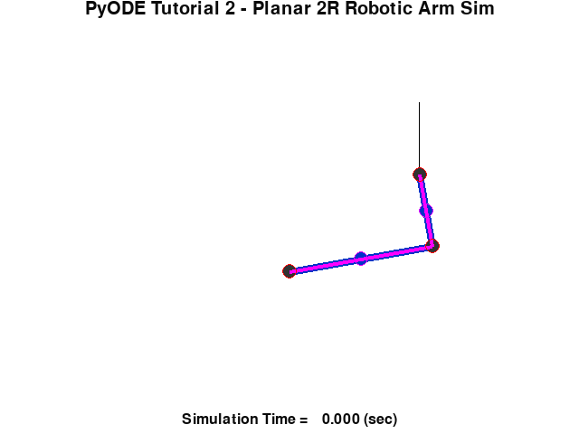  

The followimg figure depicts the ODE and RK4 simulated end effector velocity components which match the constant commanded Cartesian velocity \{Vx, Vy} of \{0.0, 0.5} meters per second except in the last 0.4 seconds where the ODE simulation results diverge from the constant commanded velocity. 

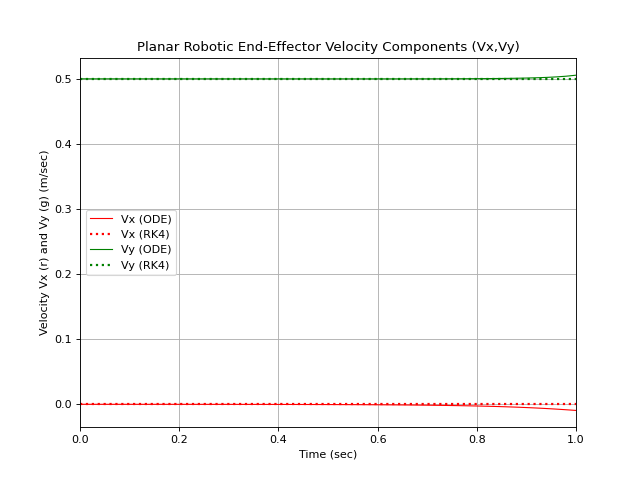  

The following three figures show very good agreement between ODE and RK4 simulated dynamics of the phsical two-link planar 2R robotic arm system. Note in the second figure immediately below, the robotic arm body linear accelerations modeled using ODE amd RK4 match the theoretical solution using Newtonian Equations of Motion (EOM).

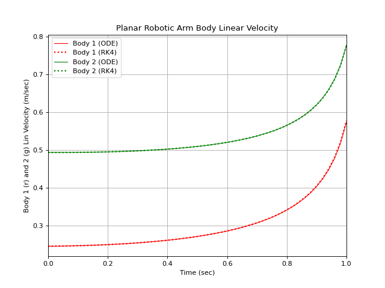
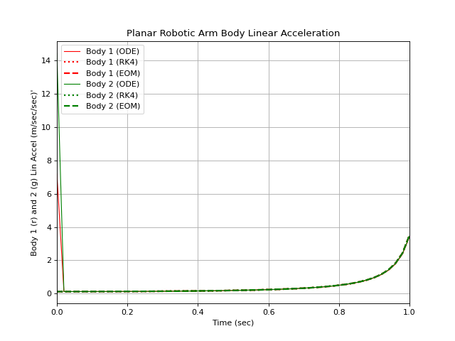
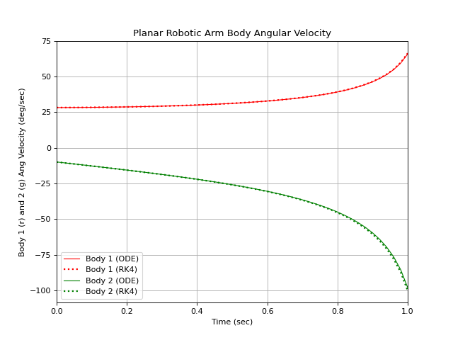  

The following five figures correspond with the plots presented in the "Numerical Dynamics Example: Plots" section on page 95 of reference \[8]; the last figure corresponding with the "Dynamic Results Including Gravity" Joint Torques plot. The initial discontinuities in ODE simulation results are due to the low fidelity integration scheme utilized in ODE.

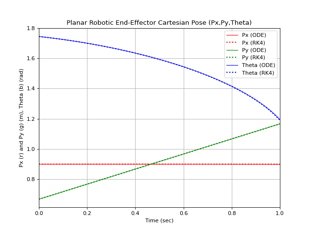
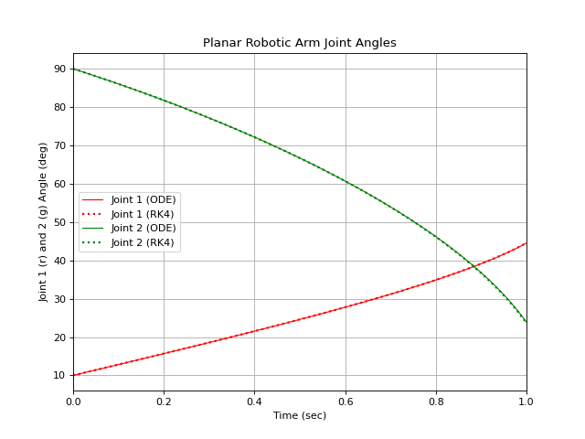
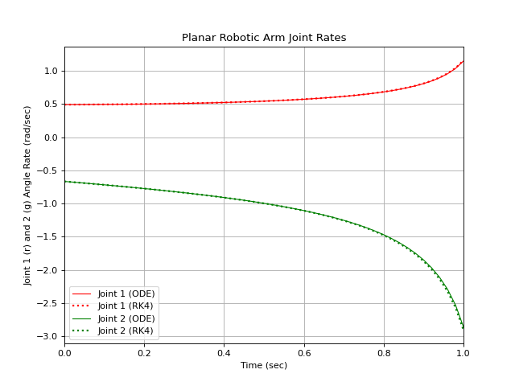
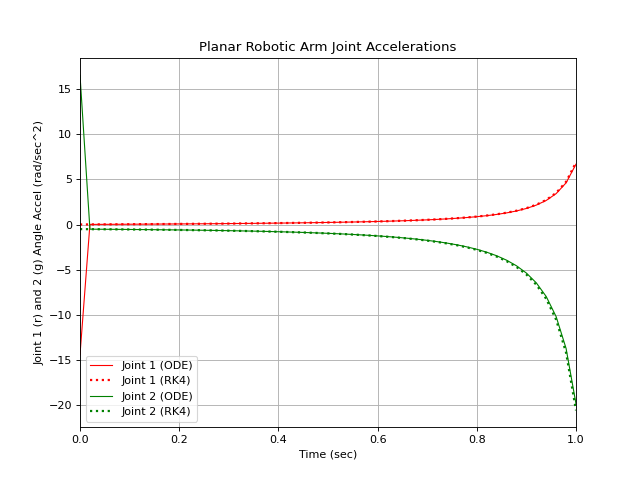
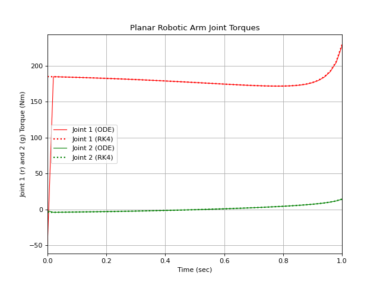  

## Disclaimer ##

  * See the file [DISCLAIMER](./DISCLAIMER)

## Epilogue ##

The architecture of the five programs presented in this repository reflect a copy and paste style of code development and should not be considered representative of good software engineering practices relevant to configuration management.

Respectfully,  
Gary Deschaines
